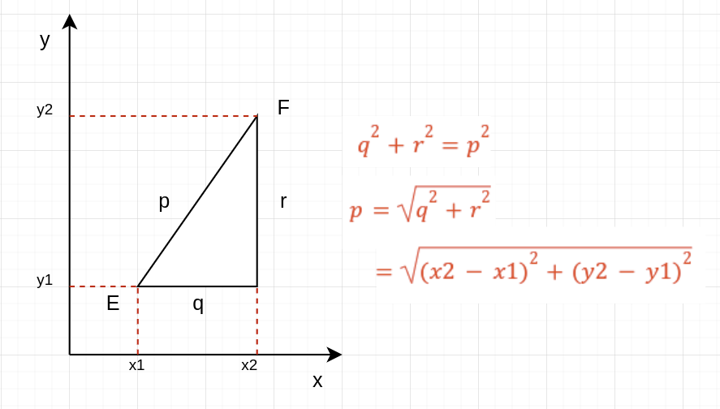

# Öklid Mesafesi Hesaplayıcı

Bu depo, verilen noktalar arasındaki Öklid mesafesini hesaplayan bir Python scripti içerir. Script, verilen noktalar arasındaki tüm çiftlerin Öklid mesafelerini hesaplar ve bunlar arasındaki en küçük mesafeyi belirler.

## Nasıl Çalışır?

Script aşağıdaki adımları gerçekleştirir:

1. **Noktaları Tanımla**: Giriş olarak bir dizi 2D nokta sağlanır.
2. **Çiftler Arası Mesafeleri Hesapla**: Script, her nokta çifti arasındaki Öklid mesafesini hesaplar.
3. **Mesafeleri Depola**: Hesaplanan tüm mesafeler bir listeye kaydedilir.
4. **En Küçük Mesafeyi Bul**: Liste içerisindeki en küçük mesafe bulunur ve ekrana yazdırılır.

## Kod

```python
import math

points = [(1, 2), (3, 4), (5, 6)]

def euclideanDistance(point1, point2):
    return math.sqrt((point2[0] - point1[0])**2 + (point2[1] - point1[1])**2)

distances = []

for i in range(len(points)):
    for j in range(i + 1, len(points)):
        distance = euclideanDistance(points[i], points[j])
        distances.append(distance)

min_distance = min(distances)

print(distances)
print(min_distance)


